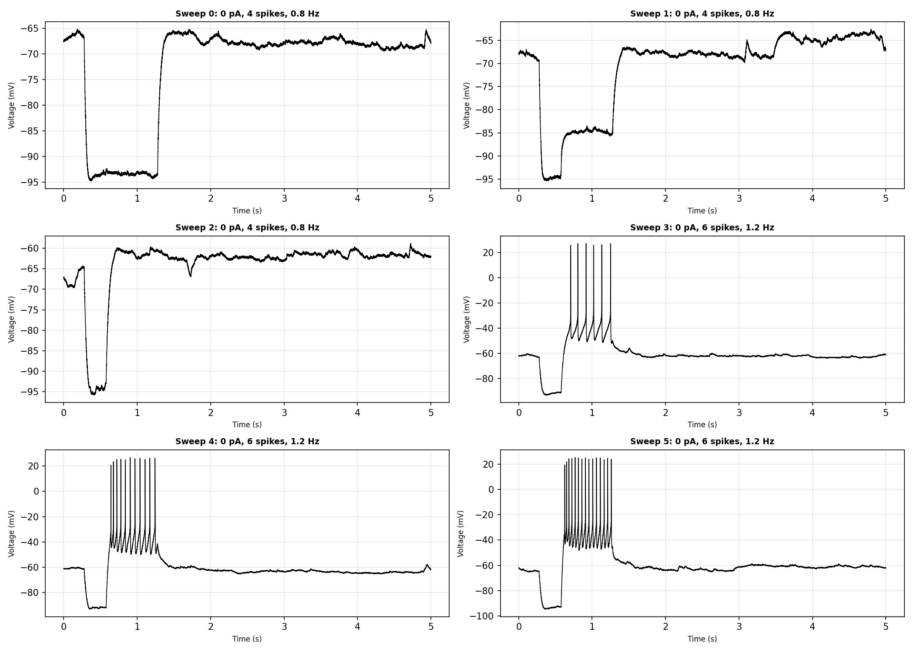
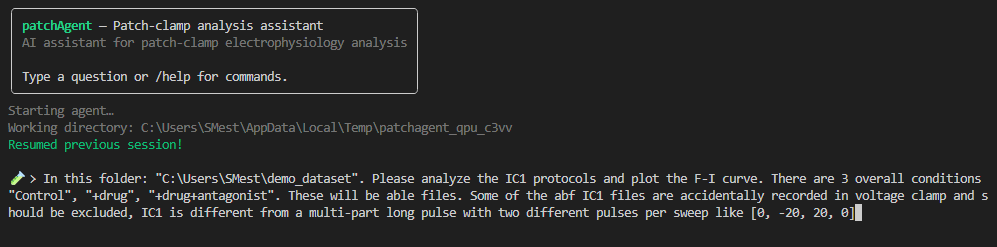
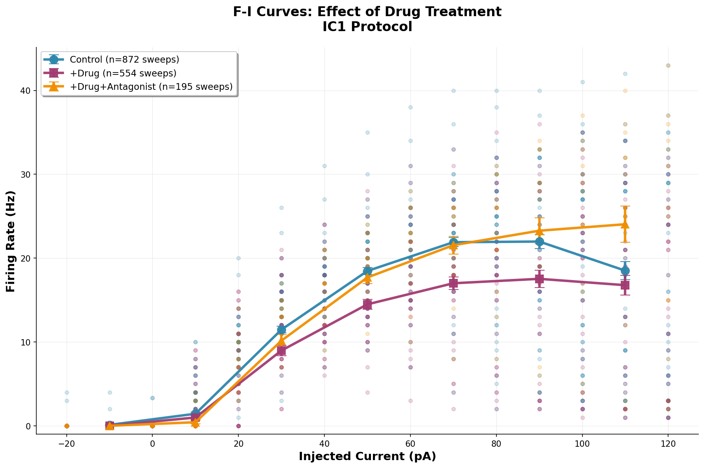
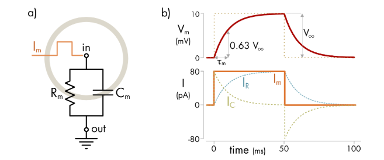
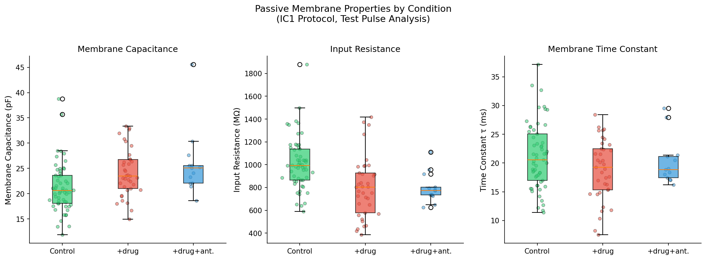

## What is this?

The current advent of AI-for-Science is really promising. I was initially skeptical of AI in general, but I have recently come around to using AI for refinement, as a sort of bounce-off point. 
To me, there is an intermediate step where Agentic AI could really help that has not been considered.  

That is, in the space of producing robust and scientifically rigorous research code in a human-in-the-loop manner. In the life sciences, many researchers come from backgrounds with little to no programming experience. They can often run a few Python scripts or set up a conda env, but beyond that, it plateaus. They often have complex analyses that they want to run on their data, but lack the programming expertise to generate research code to achieve that. 

The current AI-for-science tools focus primarily on two things:   
- Literature search & review
- End-to-End experimental pipelines (LLM does question->hypothesis->)
While these tools are great, they will help advance the field,

Most life science researchers generally don't need the AI to run end-to-end research for them. Moreover, most researchers don't have a lack of questions; we actually have too many questions and hypotheses. Where the assistance comes in is helping life science researchers design and run experimental code (also, wet-lab automation in the near future would also be super helpful! but that's a whole 'nother topic). 

With that in mind, agentic AI coding seems to revolutionize this. Researchers can now build complex code with really simple basic-language instructions. However, in my work, I notice that default agentic AI falls flat in two specific ways:
**Problem 1.** Hallucinations / Fakery at critical points. I noticed that agentic AI often writes scripts that analyze "idealized data" or simply make up data to pass tests. Sometimes it will essentially [p-hack](https://en.wikipedia.org/wiki/Data_dredging) for the researcher
**Problem 2.** Domain-specific knowledge gaps. Researchers (myself included) often use jargon and require domain-specific tools. Most models have gaps in their general background knowledge, and they likely do not have specialized libraries memorized.

I tried prototyping out some tools that I think could really help in the form of [sciagent](https://github.com/smestern/sciagent). This is essentially a framework for introducing scientific rigour and domain-specific tools to agentic AI. 
The rigour reinforcements attempt to solve **problem 1**by reminding the AI not to just make stuff up and to double- and triple-check its code and the data. For **problem 2**, domain-specific tools, I included a structure for scientists to codify their domain-specific knowledge. Also, space for defined domain-specific software packages that the scientist may want to use in their work. There is also a novice-friendly wizard that tries to self-assemble an agent for you.

## Example: PatchAgent
*See: [What is Patch-Clamp Electrophysiology?](01-what-is-patch-clamp.md)*  
### Background

My day job is [patch-clamp electrophysiology](https://en.wikipedia.org/wiki/Patch_clamp) (in particular, whole-cell patch-clamp). This is a specialized technique that allows neuroscientists to record signals from individual neurons with high precision. Using this technique, we can see what individual neurons are doing across the brain.

Patch clamp signals are highly patterned time series. There are a number of features & events one can see in a standard recording. Of particular note here are [action potentials (or spikes)](https://en.wikipedia.org/wiki/Action_potential), essentially the primary mechanism of signal propagation within a neuron. When and how action potentials occur tells us a lot about how a neuron ingests and transforms an incoming signal.   
  
*Image: The voltage response of a single neuron. Sweep 3 and onwards shows large voltage deviations that are action potentials*

### Part 1: Rudimentary Analysis

In this example, we will ask the agent to detect action potentials from neurons across three conditions. More specifically, we want to analyze the F-I curve (Frequency - Injection). Eg, how the frequency of action potentials evolves with increasing stimulation.

 
*Image: Left, The primary CLI entry point for patch-agent*

Here, we point the agent towards the files. Tell it in general, what protocol to look for, and what we want to do. Notably, the files are all in the [proprietary `ABF` format](https://swharden.com/pyabf/abf2-file-format/). SWHarden has an amazing Python package for opening these files - but general coding agents fail to reliably invoke it.

The dataset we are using is specifically interesting for a few reasons:
1. There are a few outliers in the data, hopefully the agent catches this and removes it.
2. The stimulus structure is unique compared to those normally used in this field. If the agent doesn't accommodate this, the results will be really wonky
3. I know this dataset quite well. But the agent should not know, as it's not openly available. 

The results are pretty good...   

<table><tr>
<td></td>
<td></td>
</tr></table>
*Image: Left, The model's text report; Right, the plotted F-I curves for all three conditions*

The first pass analysis works quite well. The agent has correctly identified the stimulus period to use, correctly selected some files to exclude, and correctly plotted all the F-I curves.
The agent correctly reasons that the +condition dampens the overall firing rate of the neurons, whereas the +condition+rescue restores the firing rate to that of the control

### Part 2: Asking for a Nuanced Analysis

Next, we ask the model for something more specific. Here we are asking about membrane capacitance. Neuronal membranes act as capacitors and can build and store charge. The actual overall capacity of the neuron can be seen as a proxy measure for neuronal size (since more membrane = more place to store charge), although the actual picture is [a lot more complex than](https://pubmed.ncbi.nlm.nih.gov/19571202/) that, but it's beyond the scope of this post)  
Neuroscientists will often describe neurons in a simplified manner as RC circuits. 

In this way, we can compute the membrane capacitance as a function of time constant and resistance:  

$$
\tau = RC 
$$

Therefore, the model must know to:
1. Fit an exponential to the sub-threshold component to get the time constant.
2. Compute the membrane resistance
3. Leverage these to get the Capacitance. 

All fairly simple in practice, but it does require some leveraging of background knowledge.



*Image: Left, The model computes the Capacitance accurately; Right, the plotted F-I curves for all three conditions*

Here, the model appropriately computes the capacitance. In addition, the model properly removed two outliers from the control conditions (I knew about these outliers, but wanted to see if the model would catch them)

### Part 3: A reproducible script

As noted above, the vision is for scientists to leverage the agents to generate reproducible research code. One that the scientist can easily take and apply to other datasets. So our final step is to ask the model to output a script for us to use.

The analysis script looks great! I am happy with the general output and configurable options:

```
#!/usr/bin/env python3
"""
Comprehensive Electrophysiology Analysis Script
================================================
Multi-protocol analysis of patch-clamp recordings across experimental conditions.

Analyzes:
- F-I curves and excitability (rheobase, max rate, gain)
- Passive membrane properties (Rm, τ, Cm)
- Active properties (sag ratio, rebound, adaptation)
- Action potential waveform features
- Statistical comparisons (ANOVA + Bonferroni post-hoc)

Usage:
    python ephys_analysis.py --input-dir <path> --output-dir <path>

Example:
    python ephys_analysis.py -i ./data -o ./results

Requirements:
    numpy, scipy, matplotlib, pyabf, ipfx
"""

import argparse
import json
import os
import sys
import warnings
from collections import defaultdict
from dataclasses import dataclass, field, asdict
from typing import Dict, List, Optional, Tuple, Any

import numpy as np
import pyabf
import matplotlib.pyplot as plt
from scipy import stats
from scipy.optimize import curve_fit

# Import ipfx for spike detection (required - dV/dt based detection is scientifically appropriate)
from ipfx.spike_detector import detect_putative_spikes
from ipfx.feature_extractor import SpikeFeatureExtractor, SpikeTrainFeatureExtractor

warnings.filterwarnings('ignore')


# =============================================================================
# CONFIGURATION - Modify these for your data
# =============================================================================

# Condition folder patterns (order matters - more specific patterns first)
# Maps folder name substrings to condition labels
CONDITION_PATTERNS = [
    ('+condition+rescue', '+drug+antagonist'),
    ('+conditon', '+drug'),       # handles typo in folder name
    ('+condition', '+drug'),
    ('control', 'Control'),
]

# Conditions to analyze (in order for plots)
CONDITIONS = ['Control', '+drug', '+drug+antagonist']

# Plot colors
COLORS = {
    'Control': '#2ecc71',
    '+drug': '#e74c3c', 
    '+drug+antagonist': '#3498db'
}

# Protocol timing (seconds) - adjust for your protocols
# IC1 protocol
IC1_BASELINE = (0.0, 0.25)
IC1_TEST_PULSE = (0.278, 0.578)   # -20pA test pulse for passive properties
IC1_FI_PULSE = (0.578, 1.278)    # Variable current for F-I curve

# 500ms step protocol
STEP500_PULSE = (0.578, 1.078)

# QC thresholds
MIN_TAU_FIT_QUALITY = 0.8
CM_BOUNDS = (5, 500)  # pF


# =============================================================================
# DATA CLASSES
# =============================================================================

@dataclass
class CellData:
    """Container for all measurements from a single cell."""
    cell_id: str
    condition: str
    
    # F-I curve data
    fi_currents: List[float] = field(default_factory=list)
    fi_rates: List[float] = field(default_factory=list)
    rheobase: Optional[float] = None
    max_firing_rate: Optional[float] = None
    fi_gain: Optional[float] = None
    
    # Passive properties
    Rm: Optional[float] = None      # MOhm
    tau: Optional[float] = None     # ms
    Cm: Optional[float] = None      # pF
    
    # Active properties
    sag_ratio: Optional[float] = None
    rebound_mv: Optional[float] = None
    adaptation_index: Optional[float] = None
    
    # AP waveform
    ap_threshold: Optional[float] = None    # mV
    ap_amplitude: Optional[float] = None    # mV
    ap_halfwidth: Optional[float] = None    # ms
    ap_rise_time: Optional[float] = None    # ms
    ap_ahp: Optional[float] = None          # mV
    ap_dvdt_max: Optional[float] = None     # mV/ms
    
    # Resting/spontaneous
    resting_potential: Optional[float] = None  # mV
    spontaneous_rate: Optional[float] = None   # Hz


# =============================================================================
# UTILITY FUNCTIONS
# =============================================================================

def get_condition(filepath: str) -> Optional[str]:
    """Determine experimental condition from file path."""
    path_lower = filepath.lower()
    for pattern, condition in CONDITION_PATTERNS:
        if pattern in path_lower:
            return condition
    return None


def get_cell_id(filepath: str) -> str:
    """Extract cell ID from file path (experiment/cell folder)."""
    parts = filepath.replace('/', os.sep).split(os.sep)
    if len(parts) >= 4:
        return f"{parts[-3]}/{parts[-2]}"
    return os.path.basename(filepath)


def is_current_clamp(abf: pyabf.ABF) -> bool:
    """Check if recording is in current clamp mode."""
    return 'mV' in abf.adcUnits[0]


def exp_decay(t: np.ndarray, a: float, tau: float, c: float) -> np.ndarray:
    """Exponential decay: y = a * exp(-t/tau) + c"""
    return a * np.exp(-t / tau) + c


def detect_spikes(voltage: np.ndarray, time: np.ndarray,
                  dv_cutoff: float = 20.0, filter_cutoff: float = None
                  ) -> Tuple[int, np.ndarray, np.ndarray]:
    """
    Detect action potentials in voltage trace using dV/dt threshold (ipfx).
    
    Uses ipfx.spike_detector.detect_putative_spikes which detects spikes based on
    the rate of voltage change (dV/dt), which is more scientifically appropriate
    than simple voltage threshold methods.
    
    Args:
        voltage: Voltage trace in mV
        time: Time array in seconds
        dv_cutoff: dV/dt threshold for spike detection (mV/ms), default 20
        filter_cutoff: Bessel filter cutoff in kHz (auto-calculated if None)
    
    Returns: (spike_count, spike_times, spike_indices)
    """
    # Calculate appropriate filter cutoff (must be < Nyquist frequency)
    if filter_cutoff is None:
        dt = np.mean(np.diff(time))
        sample_rate = 1.0 / dt  # Hz
        # Filter cutoff must be less than Nyquist (sample_rate/2)
        # ipfx uses kHz, so convert and use safe margin
        filter_cutoff = min(10.0, (sample_rate / 2000) * 0.8)
    
    # Use ipfx dV/dt-based detection
    spike_indices = detect_putative_spikes(voltage, time, 
                                            filter=filter_cutoff,
                                            dv_cutoff=dv_cutoff)
    spike_times = time[spike_indices] if len(spike_indices) > 0 else np.array([])
    return len(spike_indices), spike_times, spike_indices


def find_abf_files(input_dir: str) -> Dict[str, List[str]]:
    """Find and organize ABF files by protocol."""
    files_by_protocol = defaultdict(list)
    for root, _, files in os.walk(input_dir):
        for f in files:
            if f.lower().endswith('.abf'):
                path = os.path.join(root, f)
                try:
                    abf = pyabf.ABF(path)
                    files_by_protocol[abf.protocol].append(path)
                except:
                    pass
    return files_by_protocol

....
```