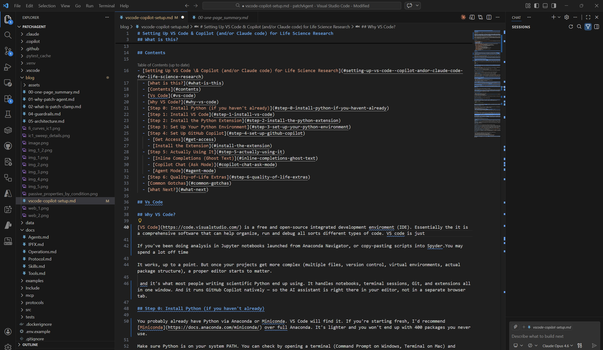

*# Setting Up VS Code & Copilot (and/or Claude code) for Life Science Research

## What is this?

This guide was written for colleagues in my lab to help them setup VS Code and use the native AI coding tools to beef up their scientific code. 

More and more life science researchers are expected to know some basic coding / scripting in order conduct their research. This is especially true, as high impact papers in life sciences are expected to be multifaceted and include several integrated techniques. 
Most individuals entering grad school now have a decent understanding of basic scripting, setting up python/matlab/R, and running rudimentary analysis. However, things get iffy when they are expected to write Software engineer-level reproducible code, or debug packages & setups (getting CUDA working anywhere is a living nightmare, if AI ever figures this out it means we achieved AGI).

I have been pretty AI skeptic, but I have been fiddling with the new flagship models (GPT-Codex-5.3, Claude Opus 4.5/4.6, and Gemini 3). I think AI-for-science can really impact current grad students by helping them write rigorous reproducible scientific code. I am thinking specific in a human-in-the-loop manner, in a way that grad students can describe the analysis they want to do, and write and debug code with AI assistance. 

There are a couple of caveats to this, but I'll cover that below.

## Contents

- [What is this?](#what-is-this)
- [Contents](#contents)
- [Vs Code](#vs-code)
- [Why VS Code?](#why-vs-code)
- [Step 0: Install Python (if you haven't already)](#step-0-install-python-if-you-havent-already)
- [Step 1: Install VS Code](#step-1-install-vs-code)
- [Step 2: Install the Python Extension](#step-2-install-the-python-extension)
- [Step 3: Set Up Your Python Environment](#step-3-set-up-your-python-environment)
- [Step 4: Set Up GitHub Copilot](#step-4-set-up-github-copilot)
  - [Get Access](#get-access)
  - [Install the Extension](#install-the-extension)
- [Step 5: Actually Using It](#step-5-actually-using-it)
  - [Inline Completions (Ghost Text)](#inline-completions-ghost-text)
  - [Copilot Chat (Ask Mode)](#copilot-chat-ask-mode)
  - [Agent Mode](#agent-mode)
- [Step 6: Quality-of-Life Extras](#step-6-quality-of-life-extras)
- [Common Gotchas](#common-gotchas)
- [What Next?](#what-next)

## Vs Code

## Why VS Code?

[VS Code](https://code.visualstudio.com/) is a free and open-source integrated development enviroment (IDE). Essentially the it is a comprehensive software that can help organize, run and debug all sorts different types of code. VS Code is just one of several IDEs (you may have tried Spyder, also an IDE), but its widely adopted these days due to its price, performance, and general flexibility. Even if you don't intend to use AI-features, I do recommend using an IDE (VS Code or Spyder) for general help with syntax highlighting, debugging, and inline function definitions.


*Image; the main interface of VS Code; Left, the primary file interface - You can organize files into folders and subfolders!; Middle, The file editor/canvas, this is where your code will be, as you can see I am writing this in VS Code!; Right, The AI-chat interface for inline editing.*

If


## Step 0: Install Python (if you haven't already)

You probably already have Python via Anaconda or Miniconda. VS Code will find it. If you're starting fresh, I'd recommend [Miniconda](https://docs.anaconda.com/miniconda/) over full Anaconda. It's lighter and you won't end up with 400 packages you never use.

Make sure Python is on your system PATH. You can check by opening a terminal (Command Prompt on Windows, Terminal on Mac) and typing:

```bash
python --version
```

If that prints something like `Python 3.10.x`, you're good. If it errors, you need to either install Python or fix your PATH (Google your OS + "add python to path" — this is unfortunately one of those things that varies by machine).

## Step 1: Install VS Code

Download it from [code.visualstudio.com](https://code.visualstudio.com/). Run the installer. The defaults are fine, but I'd check these two boxes if they're offered:

- **"Add to PATH"** — lets you open VS Code from the terminal by typing `code .` in any folder
- **"Register as default editor"** — optional, but convenient

Once it's installed, open it. You'll see an empty window with a welcome tab.

## Step 2: Install the Python Extension

VS Code doesn't know how to run Python out of the box — you need to install the Python extension.

1. Click the **Extensions** icon on the left sidebar (looks like four squares, one detached)
2. Search for **"Python"**
3. Install the one by **Microsoft** (it'll be the first result, with millions of downloads)

This gets you syntax highlighting, IntelliSense (autocomplete), virtual environment detection, and the ability to run Jupyter notebooks directly in VS Code. Yes, `.ipynb` files just work. You don't need to run `jupyter notebook` in a terminal anymore.

While you're here, also install **"Jupyter"** by Microsoft. It should auto-install with the Python extension, but double check.

## Step 3: Set Up Your Python Environment

This is the step that trips up most people. VS Code needs to know *which* Python to use — especially if you have multiple conda environments or virtualenvs.

1. Open a folder with your project files: **File → Open Folder**
2. Press `Ctrl+Shift+P` (or `Cmd+Shift+P` on Mac) to open the Command Palette
3. Type **"Python: Select Interpreter"** and hit Enter
4. Pick your environment from the list

If you're using conda, you'll see entries like `Python 3.X.X ('myenv': conda)`. Pick the one that has your analysis packages installed. If you don't see your environment, you may need to restart VS Code after creating it.

**Pro tip:** If you create a virtual environment inside your project folder (e.g., `python -m venv .venv`), VS Code will auto-detect it next time you open that folder. This is nice for reproducibility, as each project gets its own isolated packages.

## Step 4: Set Up GitHub Copilot

This is the part you're probably here for. [GitHub Copilot](https://github.com/features/copilot) is an AI coding assistant that runs inside VS Code. It autocompletes code, answers questions about your codebase, and (in Agent mode) can write and run multi-step analyses for you.

### Get Access

You need a GitHub account and a Copilot subscription. A few options:

- **Free tier** — GitHub offers a free tier of Copilot with limited completions per month. For most researchers, this is probably enough to start with.
- **Pro ($10/month)** — Unlimited completions, the chat features, and access to different models (Claude, GPT-4o, etc.)
- **Free for students/academics** — If you have a `.edu` email, you can get Copilot Pro for free through [GitHub Education](https://education.github.com/). Seriously, do this if you can.

### Install the Extension

1. Go to **Extensions** in VS Code (same as before)
2. Search **"GitHub Copilot"**
3. Install it. There are two related extensions — **GitHub Copilot** and **GitHub Copilot Chat**. Install both (installing the first should pull in the second automatically)
4. You'll be prompted to sign in to GitHub. Do that.

Once signed in, you should see a small Copilot icon in the bottom status bar of VS Code. If it's there, you're connected.

## Step 5: Actually Using It

Copilot works in three modes. Each is useful for different things.

### Inline Completions (Ghost Text)

This is the default. As you type code, Copilot suggests completions in grey text. Press `Tab` to accept, `Esc` to dismiss. It reads your open file, variable names, comments, and imports to figure out what you probably want next.

For example, if you type:

```python
# Load the ABF file and extract sweep 3
```

Copilot will likely suggest something reasonable below the comment. It's not always right, but it's surprisingly good at boilerplate. I use it mostly for things like matplotlib formatting, pandas operations, and NumPy indexing — stuff I know *how* to do but don't want to type out every time.

### Copilot Chat (Ask Mode)

Press `Ctrl+Shift+I` (or click the chat icon in the sidebar) to open Copilot Chat. This is a conversational interface where you can ask questions about your code, your workspace, or programming in general.

Some things I actually use it for:
- "What does this function do?" (highlight code first)
- "How do I reshape this array from (n_sweeps, n_timepoints) to (n_timepoints, n_sweeps)?"
- "Write a function that computes input resistance from a V-I plot"

It has access to your open files, so it can reference your actual variables and data structures rather than guessing.

### Agent Mode

This is the mode where Copilot can actually edit files, run terminal commands, and iterate on code by itself. You access it through the same chat panel — there's a dropdown at the top where you can switch between **Ask**, **Edit**, and **Agent** mode.

For research, this is the most useful one. You can say something like "load all the CSV files in my data folder, compute the mean and SEM for each condition, and plot them as a bar chart with individual data points" — and it'll actually write a script, run it, and show you the output. If something errors, it reads the traceback and fixes it.

Fair warning though: it can and will hallucinate function calls or make up data if you're not paying attention. Always review the code it writes. This is one of the reasons I built [patchAgent](https://github.com/smestern/patchAgent) with explicit guardrails — but even without that, Copilot in Agent mode is pretty useful for exploratory analysis, as long as you keep an eye on it.

## Step 6: Quality-of-Life Extras

A few more extensions worth installing once you're set up:

- **GitLens** — shows Git blame annotations inline (who changed what, when). Useful once you start version-controlling your analysis scripts.
- **Markdown Preview Enhanced** — if you write lab notes or documentation in Markdown (you should), this makes previewing them much nicer.
- **Rainbow CSV** — color-codes columns in CSV files when you open them. Sounds dumb, but it's actually really nice when your data has 40 columns.
- **Error Lens** — highlights errors and warnings inline in the editor rather than hiding them in a separate panel. Saves you from digging through the problems tab.

## Common Gotchas

A few things that I've seen trip up basically every researcher who switches to VS Code:

**"Module not found" errors.** This almost always means VS Code is using the wrong Python environment. Check the interpreter (bottom-left of the status bar) and make sure it's the one where your packages are installed. This gets everyone at least once.

**Notebooks feel different.** VS Code's notebook experience is slightly different from Jupyter's browser interface. The keyboard shortcuts are different (`Shift+Enter` to run a cell still works though). Give it a day, you'll adjust.

**Git keeps asking me to sign in.** If you're using Git over HTTPS, install the [Git Credential Manager](https://github.com/git-ecosystem/git-credential-manager) and it'll stop bothering you.

**Copilot suggestions are wrong/annoying.** You can toggle completions on and off per language. If it's getting in the way while you're writing prose (like a README), just disable it for Markdown temporarily. `Ctrl+Shift+P` → "Copilot: Toggle Completions."

## What Next?

At this point you've got a working setup: VS Code, Python, and Copilot. From here you can:

- Open an existing Jupyter notebook and run it as-is in VS Code
- Start a new Python script and let Copilot help you write analysis code
- Try Agent mode on a small task and see how it handles your data
- Set up Git for version control (that's a whole separate post, but [the VS Code docs](https://code.visualstudio.com/docs/sourcecontrol/intro-to-git) are genuinely good)

The gap between "I know what analysis I want to run" and "I have working code that does it" is a lot smaller than it used to be. The tooling still has rough edges, but it's at the point where you can get pretty far with just basic Python and a willingness to poke around.
*